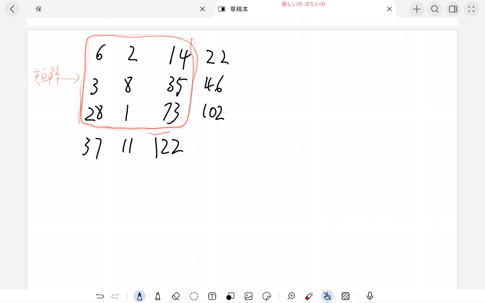

# 第二次考核

## 考核主要知识点

**C++语言基础语法：输入输出，判断，循环，数组，简单算法**

## 评判标准
1. **程序能否正确运行出要求的结果**

1. **变量命名是否清晰，书写是否工整有条理**

1. **注释是否完整。（不要求每一行都要有注释，关键变量判断，算式都要有注释）**

***提交时把工程文件和输出结果一起提交***

## 题目
***编写一个程序，要求用户输入9个100以内的整数，存储在一个数组中。***
1. **将这个数组由小到大和由大到小排列，并把他们分别打印出来。**
2. **创建一个3x3的二维数组，将输入的数组填充到这个二维数组中，并以矩阵的形式打印这个二维数组，并计算出，每一行每一列的和**

### 输出结果如下图
